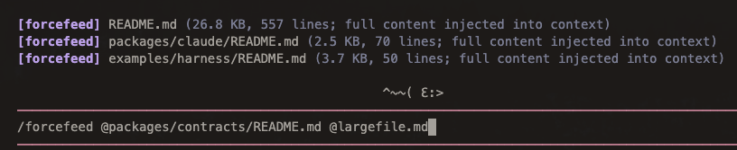

<p align="center">
  
</p>

<h3 align="center">House of Pi</h3>

<p align="center">A collection of extensions for <a href="https://pi.dev">pi</a>.</p>

## Packages

### [@alasano/pi-panels](packages/pi-panels)

Responsive status panels rendered below the editor - git info, LLM context usage, and Spotify now-playing.

<p align="center">
  
</p>

```bash
pi install npm:@alasano/pi-panels
```

### [@alasano/pi-mouse](packages/pi-mouse)

An ASCII mouse that lives above your editor. It follows your cursor as you type, scurrying left and right with an animated tail.

<p align="center">
  
</p>

```bash
pi install npm:@alasano/pi-mouse
```

### [@alasano/pi-linear](packages/pi-linear)

Linear integration with 55+ tools for issues, projects, documents, initiatives, comments, relations, and more. Multi-workspace auth and per-tool settings overlay.

<p align="center">
  
</p>

```bash
pi install npm:@alasano/pi-linear
```

### [@alasano/pi-exa](packages/pi-exa)

[Exa](https://exa.ai)-powered web search, content retrieval, answers, and agentic search tools for pi. Matches the official Exa MCP server's current search/content tool surface, then adds Exa's Answer API and the newly announced Exa Agent API.

<p align="center">
  
</p>

```bash
pi install npm:@alasano/pi-exa
```

### [@alasano/pi-extra-context](packages/pi-extra-context)

Load extra configured project, ancestor, global, or absolute context files into pi sessions.

<p align="center">
  
</p>

```bash
pi install npm:@alasano/pi-extra-context
```

### [@alasano/pi-forcefeed](packages/pi-forcefeed)

Force-feed complete files into pi conversation context without read-tool truncation.

<p align="center">
  
</p>

```bash
pi install npm:@alasano/pi-forcefeed
```
