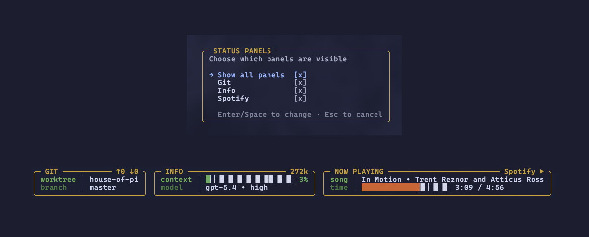
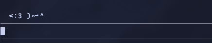

<p align="center">
  
</p>

<h3 align="center">House of Pi</h3>

<p align="center">A collection of extensions for <a href="https://pi.dev">pi</a>.</p>

## Packages

### [@alasano/pi-panels](packages/pi-panels)

Responsive status panels rendered below the editor - git info, LLM context usage, and Spotify now-playing.



```bash
pi install npm:@alasano/pi-panels
```

### [@alasano/pi-mouse](packages/pi-mouse)

An ASCII mouse that lives above your editor. It follows your cursor as you type, scurrying left and right with an animated tail.



```bash
pi install npm:@alasano/pi-mouse
```
