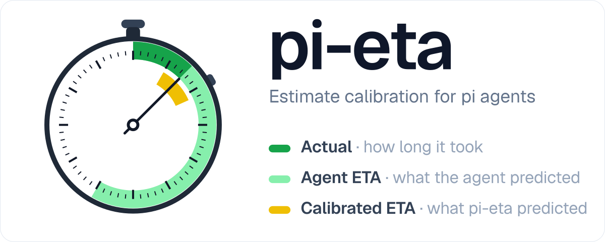
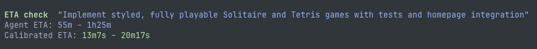
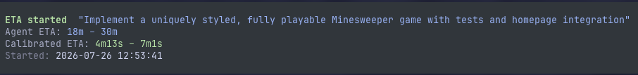
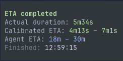
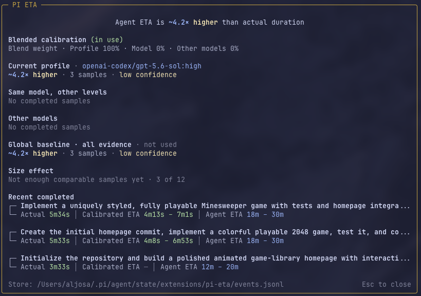

# pi-eta

<p align="center">
  
</p>

Estimate calibration for [pi](https://pi.dev) agents.

Agents are terrible at estimating how long things will take. `pi-eta` fixes that by having the agent give an estimate, measuring how long the work actually takes, and building calibration from the difference so the ETA you see is corrected.

The agent hands over its estimate and only gets a confirmation back. The calibrated ETA, the multiplier, and the confidence stats are shown only to you. If the agent knew it always runs 3x over it could start padding its estimates, and then calibration would be training on padded numbers.

## Install

```bash
pi install npm:pi-eta
```

## Tools

| Tool         | Description                                                              |
| ------------ | ------------------------------------------------------------------------ |
| `eta_check`  | Privately show the user a calibrated estimate without starting a timer   |
| `eta_start`  | Start a wall-clock ETA timer from the agent's own estimate               |
| `eta_finish` | Close an ETA timer as completed, abandoned, scope-changed, or superseded |

The agent only receives confirmation text. Calibrated estimates, multipliers, confidence, and spread are rendered to the user through tool UI details.

<p align="center">
  
  <br />
  <sub><em>eta_check</em></sub>
</p>

---

<p align="center">
  
  <br />
  <sub><em>eta_start</em></sub>
</p>

<p align="center">
  
  <br />
  <sub><em>eta_finish</em></sub>
</p>

## Commands

| Command               | Description                                       |
| --------------------- | ------------------------------------------------- |
| `/eta`                | Open the Pi ETA stats overlay                     |
| `/eta stats`          | Same as `/eta`                                    |
| `/eta verbose`        | Toggle persistent verbose tool output             |
| `/eta verbose on`     | Enable persistent verbose tool output             |
| `/eta verbose off`    | Disable persistent verbose tool output            |
| `/eta verbose status` | Show whether persistent verbose output is enabled |
| `/eta reset`          | Confirm and append a reset marker                 |

Verbose output is disabled by default. Pressing Ctrl+O on a Pi ETA tool temporarily shows the same details as verbose mode without changing the saved preference. `/eta reset` does not delete the raw event log; it appends a reset event and excludes earlier data from future calibration.

<p align="center">
  
  <br />
  <sub><em>/eta</em></sub>
</p>

## Calibration

Calibration is tracked separately for each model and thinking level combination, since the same model at `low` and at `xhigh` behaves very differently against the clock.

How the multiplier, blending, and the size effect are computed is in [CALIBRATION.md](CALIBRATION.md).

## Storage

Events and display settings are stored globally under the Pi agent directory:

```text
~/.pi/agent/state/extensions/pi-eta/events.jsonl
~/.pi/agent/state/extensions/pi-eta/settings.json
```

Event writes are append-only and protected with a small lock directory so multiple Pi sessions can record events safely. Settings are written atomically and persist across sessions and Pi restarts.

### Advanced calibration settings

Calibration policy is configured directly in `settings.json`; run `/reload` after editing it:

```json
{
  "verbose": false,
  "calibrationMode": "blended",
  "profileSampleThreshold": 3
}
```

| Mode                | Behavior                                                                   |
| ------------------- | -------------------------------------------------------------------------- |
| `blended`           | Default. Shrink the exact profile through its model toward other models.   |
| `profile`           | Strictly use the current model and thinking level, with no fallback.       |
| `global`            | Strictly use calibration across all eligible completed tasks.              |
| `profile-threshold` | Use global calibration until the profile reaches `profileSampleThreshold`. |

`profileSampleThreshold` must be a positive integer, defaults to `3`, and is ignored outside `profile-threshold` mode. Invalid settings fall back to the defaults.

## Behavior notes

- Calibration uses wall time: `eta_finish - eta_start`.
- Only `outcome=completed` trains calibration.
- `abandoned`, `scope_changed`, and `superseded` close the timer but are excluded from calibration.
- Changing the model or thinking level while a task is open records one durable marker. Such mixed-profile tasks stay in history and in the overlay but train nothing.
- One ETA task may be open per Pi session.
- Agents are instructed not to infer or restate hidden calibrated values.

### Known limitation

Calibration measures wall time, which for long tasks can include user pauses, waiting between turns, and overnight gaps. That inflates long-task durations and can exaggerate a measured size effect. Distinguishing active agent time from elapsed wall time is not implemented.

This will be implemented once [earendil-works/pi#7147](https://github.com/earendil-works/pi/issues/7147) is approved. Right now an extension can't know when an approval dialog is sitting open, and that issue adds the missing events around UI dialogs. Once it lands, calibration can use active agent time instead of raw wall time.

## Requirements

- Pi 0.82.1 or newer.
- Node.js 22.19 or newer.
