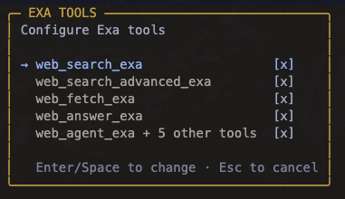
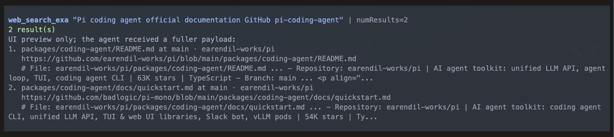

# @alasano/pi-exa

<p align="center">
  
</p>

<p align="center"><em>Configure Exa tools from the settings overlay.</em></p>

---

<p align="center">
  
</p>

<p align="center"><em>Readable web search previews keep the UI clean while full tool output remains available to the agent.</em></p>

[Exa](https://exa.ai)-powered web search, content retrieval, answers, and agentic search tools for [pi](https://pi.dev). This package has parity with the official Exa MCP server's current search and content-retrieval tools, then adds two Pi-specific capabilities: Exa's Answer API and the newly announced Exa Agent API for long-running research workflows.

It also ships a bundled `exa-search` skill that guides the agent on when to search, when to fetch, when to use Answer, and when to escalate to Exa Agent without flooding context.

## Prerequisites

You need an [Exa API key](https://dashboard.exa.ai/api-keys).

## Install

```bash
pi install npm:@alasano/pi-exa
```

## Authentication

Set `EXA_API_KEY` in the environment before starting pi, or run:

```sh
/exa-auth set
```

The command stores credentials under the pi agent directory for this package only.

## Settings

Run `/exa-settings` to open the tool settings overlay. Search, advanced search, fetch, and answer can be toggled individually. Agent lifecycle tools are toggled as one group so create/get/list/cancel/delete/events stay consistent.

Disabled tools are removed from the agent's active tool list immediately for the next turn.

## Skill

The package includes the `exa-search` skill. It guides the agent to:

- start with lightweight search for source discovery
- use advanced search only when filters or content controls matter
- fetch selected URLs instead of dumping broad page text
- use Answer for concise sourced answers
- use the newly announced Exa Agent API for deeper multi-hop or long-running async research workflows
- retrieve the full stored Agent result after compact background completion notices

## Workflow

Use the tools as a pipeline:

1. `web_search_exa` for normal source discovery.
2. `web_search_advanced_exa` when domains, dates, categories, freshness, summaries, highlights, subpages, or extracted text matter.
3. `web_fetch_exa` for selected URLs that need full markdown content.
4. `web_answer_exa` when a direct answer with sources is enough.
5. `web_agent_exa` when the task is bigger than search: long-running research, multi-hop source gathering, or structured output across many sources.

Foreground Agent runs return the full Agent result to the agent. Background Agent runs return promptly, show a persistent status panel, and send a compact completion notice that tells the agent to call `web_agent_get_exa` before using detailed findings.

## Tools (10)

### Search, Content, And Answers

| Tool                      | Description                                                                                                                                              |
| ------------------------- | -------------------------------------------------------------------------------------------------------------------------------------------------------- |
| `web_search_exa`          | Search the web with compact, highlight-first results for normal source discovery.                                                                        |
| `web_search_advanced_exa` | Search with filters and content controls: domains, dates, categories, freshness, summaries, highlights, subpages, text extraction, and response context. |
| `web_fetch_exa`           | Retrieve clean markdown/text content from selected known URLs. Defaults to bounded content so fetches stay focused.                                      |
| `web_answer_exa`          | Ask Exa's Answer API for a direct sourced answer when a result list would be too much.                                                                   |

### Exa Agent

`web_agent_exa` is the main Agent tool. Use it for high-value async workflows that need more than search/fetch/answer: long-running research, structured JSON output, or multi-hop source gathering.

| Tool                   | Role                                                                                                           |
| ---------------------- | -------------------------------------------------------------------------------------------------------------- |
| `web_agent_exa`        | Create an Agent run. Supports foreground wait mode and background tracking.                                    |
| `web_agent_get_exa`    | Retrieve the full stored Agent result, including text, structured output, citation grounding, usage, and cost. |
| `web_agent_list_exa`   | List recent Agent runs to find IDs or inspect statuses.                                                        |
| `web_agent_cancel_exa` | Cancel a queued or running Agent run.                                                                          |
| `web_agent_delete_exa` | Delete a stored Agent run when explicitly requested.                                                           |
| `web_agent_events_exa` | Inspect stored lifecycle events or replay the event stream for debugging/progress history.                     |

## Agent Modes

| Mode                              | Behavior                                                                                                                                                |
| --------------------------------- | ------------------------------------------------------------------------------------------------------------------------------------------------------- |
| `mode: "wait", monitor: "stream"` | Foreground run with server-sent lifecycle events. Best default when the user needs the result in the current turn.                                      |
| `mode: "wait", monitor: "poll"`   | Foreground run using `GET /agent/runs/{id}` polling. Useful if streaming is undesirable.                                                                |
| `mode: "background"`              | Returns the run ID immediately, tracks the run in a pi widget, and sends a compact follow-up when it finishes. `monitor` is ignored in background mode. |

## Output And Context Discipline

- Search defaults to compact highlights rather than full page text.
- Advanced search returns extracted text by default; use `textMaxCharacters` for broad queries.
- Fetch is for selected known URLs, not broad discovery.
- Agent foreground/get results return full structured output and citation grounding to the agent.
- Background completion notices stay compact and instruct the agent to retrieve the full result before answering in detail.
- Ctrl+O in the UI exposes expanded previews/raw API diagnostics without changing what the agent receives.
