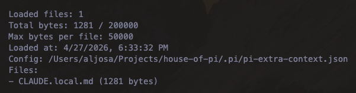

# pi-extra-context



Load extra configured context files into [pi](https://pi.dev) sessions.

`pi-extra-context` is a small extension for adding project, ancestor, global, or absolute Markdown/text files to the system prompt alongside Pi's built-in `AGENTS.md` / `CLAUDE.md` context.

## Install

```bash
pi install npm:@alasano/pi-extra-context
```

## Configuration

Create one or both config files:

| Path                                           | Scope         |
| ---------------------------------------------- | ------------- |
| `~/.pi/agent/extensions/pi-extra-context.json` | Global        |
| `.pi/pi-extra-context.json`                    | Project-local |

Global and project configs are merged. File entries are appended in this order:

1. global config files
2. project config files

Project config values override global values for limits like `maxBytesPerFile` and `maxTotalBytes`.

### Example: load `CLAUDE.local.md`

```json
{
  "files": [
    {
      "path": "CLAUDE.local.md",
      "mode": "ancestor",
      "optional": true
    }
  ]
}
```

With `mode: "ancestor"`, the extension walks from the filesystem root to the current working directory and loads matching files parent-first. This mirrors Pi's built-in parent-directory context behavior, but for files you choose.

### Example: load project rules and global notes

```json
{
  "files": [
    {
      "path": ".cursor/rules/*.md",
      "mode": "project",
      "optional": true
    },
    {
      "path": "local-context/**/*.md",
      "mode": "global",
      "optional": true
    },
    {
      "path": "~/Notes/pi/**/*.md",
      "mode": "absolute",
      "optional": true
    }
  ],
  "maxBytesPerFile": 50000,
  "maxTotalBytes": 200000
}
```

## File entries

Each file entry supports:

| Field      | Type      | Default     | Description                              |
| ---------- | --------- | ----------- | ---------------------------------------- |
| `path`     | `string`  | required    | File path or glob pattern                |
| `mode`     | `string`  | `"project"` | How to resolve `path`                    |
| `optional` | `boolean` | `true`      | Whether missing matches should be silent |

String shorthand is also supported:

```json
{
  "files": ["docs/project-context.md"]
}
```

String entries are treated as project-relative and optional.

## Modes

| Mode       | Resolution behavior                                     |
| ---------- | ------------------------------------------------------- |
| `project`  | Resolve `path` relative to the current Pi working dir   |
| `ancestor` | Apply `path` at every ancestor from root to current dir |
| `global`   | Resolve `path` relative to `~/.pi/agent`                |
| `absolute` | Resolve `path` as an absolute or `~`-prefixed path      |

Paths may use Node's built-in glob syntax. This package requires Node `>=22.17.0`, where `fsPromises.glob()` is stable.

## Limits

Defaults:

```json
{
  "maxBytesPerFile": 50000,
  "maxTotalBytes": 200000
}
```

Files exceeding `maxBytesPerFile` are skipped. Files that would exceed `maxTotalBytes` are also skipped. Skipped files appear in `/pi-extra-context status`.

## Commands

| Command                    | Description                             |
| -------------------------- | --------------------------------------- |
| `/pi-extra-context`        | Show current status                     |
| `/pi-extra-context status` | Show loaded files, limits, and warnings |
| `/pi-extra-context reload` | Reread config and context files         |

Pi also reloads the extension on `/reload`, so config and files are reread then as well.

## How it works

On session start and `/reload`, the extension:

1. reads global and project config
2. resolves configured files and glob patterns
3. deduplicates files by real path
4. enforces byte limits
5. caches file contents in memory

Before each agent turn, it appends the cached contents to the system prompt. It does **not** reread files every turn and does **not** append messages to the conversation transcript.

## Limitations

Pi's extension API does not currently allow extensions to contribute native context files through `resources_discover`. As a result, `pi-extra-context` appends cached content to the system prompt rather than registering files in Pi's native `AGENTS.md` / `CLAUDE.md` context-file list.
