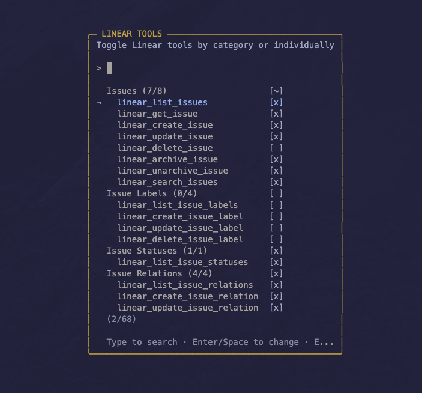

# pi-linear



Linear integration for [pi](https://pi.dev) with 55+ tools covering issues, projects, documents, initiatives, comments, relations, and more. Includes multi-workspace auth and a per-tool settings overlay.

## Prerequisites

You need a Linear API key. To create one:

1. Go to **Linear Settings > Account > Security & Access > API**
2. Click **Create key** and give it a name (e.g. "pi")
3. Under **Permissions**, select **Only select permissions** with **Read** and **Write** enabled. Leave **Admin** unchecked.
4. Under **Team access**, choose **All teams you have access to** or scope to specific teams if you prefer
5. Click **Create** and copy the key

## Install

```bash
pi install npm:@alasano/pi-linear
```

## Authentication

The extension auto-detects the `LINEAR_API_KEY` environment variable if set globally. No setup needed in that case.

For multi-workspace support or if you don't have the env var, use the `/linear-auth` command:

| Command                      | Description                                              |
| ---------------------------- | -------------------------------------------------------- |
| `/linear-auth add <name>`    | Add a workspace with an API key (prompts for key)        |
| `/linear-auth remove <name>` | Remove a workspace (shows selector if name omitted)      |
| `/linear-auth switch <name>` | Switch active workspace (shows selector if name omitted) |
| `/linear-auth status`        | Show current auth source and configured workspaces       |
| `/linear-auth`               | Same as status                                           |

When you add your first workspace, it becomes active automatically. Adding a second workspace prompts you to switch. After a `/reload` with two or more workspaces configured, the agent gets a `linear_switch_workspace` tool and can switch between them when asked.

Auth resolution order:

1. Active stored workspace (if any workspaces are configured)
2. `LINEAR_API_KEY` environment variable (fallback when no workspaces configured)
3. Interactive prompt (asks you to set up a key)

Credentials are stored at `~/.pi/agent/state/extensions/linear/credentials.json`.

## Tool settings

Run `/linear-settings` to open an overlay where you can enable or disable tools by category or individually. Disabled tools are removed from the LLM's context entirely. Preferences persist across sessions.

## Tools (55)

### Issues

| Tool                     | Description                                                        |
| ------------------------ | ------------------------------------------------------------------ |
| `linear_list_issues`     | List issues with filters, pagination, and sort                     |
| `linear_get_issue`       | Get full issue details by identifier (ENG-123) or id               |
| `linear_create_issue`    | Create an issue with full IssueCreateInput support                 |
| `linear_update_issue`    | Update an issue with full IssueUpdateInput support                 |
| `linear_delete_issue`    | Delete an issue (admins can permanently delete)                    |
| `linear_archive_issue`   | Archive or trash an issue                                          |
| `linear_unarchive_issue` | Restore an archived issue                                          |
| `linear_search_issues`   | Search issues by text, with optional comment search and team boost |

### Issue Labels

| Tool                        | Description                        |
| --------------------------- | ---------------------------------- |
| `linear_list_issue_labels`  | List issue labels with team filter |
| `linear_create_issue_label` | Create an issue label              |
| `linear_update_issue_label` | Update an issue label              |
| `linear_delete_issue_label` | Delete an issue label              |

### Issue Statuses

| Tool                         | Description                           |
| ---------------------------- | ------------------------------------- |
| `linear_list_issue_statuses` | List workflow states (issue statuses) |

### Issue Relations

| Tool                           | Description                                             |
| ------------------------------ | ------------------------------------------------------- |
| `linear_list_issue_relations`  | List issue relations                                    |
| `linear_create_issue_relation` | Create a relation (blocks, duplicate, related, similar) |
| `linear_update_issue_relation` | Update a relation                                       |
| `linear_delete_issue_relation` | Delete a relation                                       |

### Projects

| Tool                       | Description                                      |
| -------------------------- | ------------------------------------------------ |
| `linear_list_projects`     | List projects with filters, pagination, and sort |
| `linear_get_project`       | Get full project details by id                   |
| `linear_save_project`      | Create or update a project                       |
| `linear_delete_project`    | Delete a project                                 |
| `linear_archive_project`   | Archive or trash a project                       |
| `linear_unarchive_project` | Restore an archived project                      |

### Project Labels

| Tool                          | Description            |
| ----------------------------- | ---------------------- |
| `linear_list_project_labels`  | List project labels    |
| `linear_create_project_label` | Create a project label |
| `linear_update_project_label` | Update a project label |
| `linear_delete_project_label` | Delete a project label |

### Project Relations

| Tool                             | Description               |
| -------------------------------- | ------------------------- |
| `linear_list_project_relations`  | List project relations    |
| `linear_create_project_relation` | Create a project relation |
| `linear_update_project_relation` | Update a project relation |
| `linear_delete_project_relation` | Delete a project relation |

### Documents

| Tool                        | Description                                |
| --------------------------- | ------------------------------------------ |
| `linear_list_documents`     | List documents with filters and pagination |
| `linear_get_document`       | Get full document details by id            |
| `linear_create_document`    | Create a document                          |
| `linear_update_document`    | Update a document                          |
| `linear_delete_document`    | Delete a document                          |
| `linear_unarchive_document` | Restore an archived document               |

### Comments

| Tool                    | Description                                        |
| ----------------------- | -------------------------------------------------- |
| `linear_list_comments`  | List comments with filters and pagination          |
| `linear_create_comment` | Create a comment on an issue, project update, etc. |
| `linear_update_comment` | Update a comment                                   |
| `linear_delete_comment` | Delete a comment                                   |

### Initiatives

| Tool                          | Description                                         |
| ----------------------------- | --------------------------------------------------- |
| `linear_list_initiatives`     | List initiatives with filters, pagination, and sort |
| `linear_get_initiative`       | Get full initiative details by id                   |
| `linear_save_initiative`      | Create or update an initiative                      |
| `linear_delete_initiative`    | Delete an initiative                                |
| `linear_archive_initiative`   | Archive an initiative                               |
| `linear_unarchive_initiative` | Restore an archived initiative                      |

### Milestones

| Tool                      | Description                  |
| ------------------------- | ---------------------------- |
| `linear_list_milestones`  | List project milestones      |
| `linear_get_milestone`    | Get milestone details by id  |
| `linear_save_milestone`   | Create or update a milestone |
| `linear_delete_milestone` | Delete a milestone           |

### Teams

| Tool                | Description                     |
| ------------------- | ------------------------------- |
| `linear_list_teams` | List teams with workflow states |
| `linear_get_team`   | Get team details by id          |

### Users

| Tool                | Description            |
| ------------------- | ---------------------- |
| `linear_list_users` | List users             |
| `linear_get_user`   | Get user details by id |

### Workspaces

| Tool                      | Description                                                 |
| ------------------------- | ----------------------------------------------------------- |
| `linear_switch_workspace` | Switch active workspace (only available with 2+ workspaces) |

## Requirements

- Pi interactive mode (settings overlay uses the widget API)
