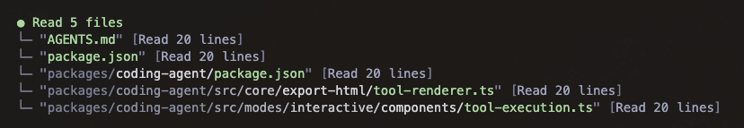

# pi-read-summary

<p align="center">
  
</p>

Compact grouped read summaries for [pi](https://pi.dev).

`pi-read-summary` replaces large individual per-file `read` tool blocks with one local summary for each contiguous batch of reads. It keeps the model-facing read behavior unchanged while making the terminal easier to scan.

## Install

```bash
pi install npm:@alasano/pi-read-summary
```

## Behavior

- Overrides Pi's built-in `read` tool renderer while delegating execution to the built-in implementation.
- Groups contiguous `read` calls into one compact summary block.
- Shows relative paths for files inside the current working directory and absolute paths for files outside it.

Collapsed output stays compact:

```text
● Read 3 files
 └─ "AGENTS.md" [Read 54 lines]
 └─ "package.json" [Read 42 lines]
 └─ "packages/coding-agent/src/core/tools/read.ts" [Read 120 lines]
```

Expanded output (ctrl+o) uses Pi's shows merged line ranges:

```text
● Read 3 files
 └─ "AGENTS.md" [Read 54 lines]
     lines 1-54
 └─ "package.json" [Read 42 lines]
     lines 1-40, lines 60-61
 └─ "packages/coding-agent/src/core/tools/read.ts" [Read 120 lines]
     lines 1-120
```

## Requirements

- Pi `0.79.9` or newer.
- Node.js 22.19.0 or newer.
